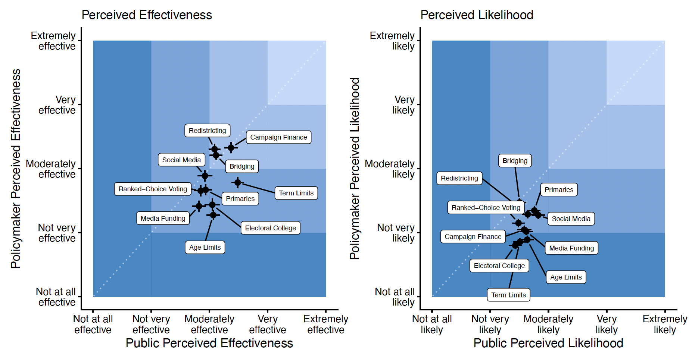
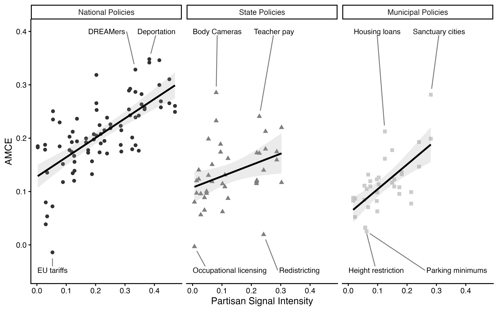
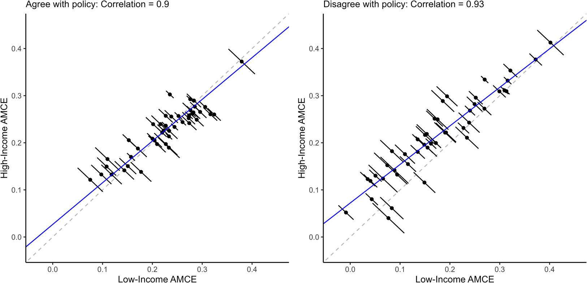
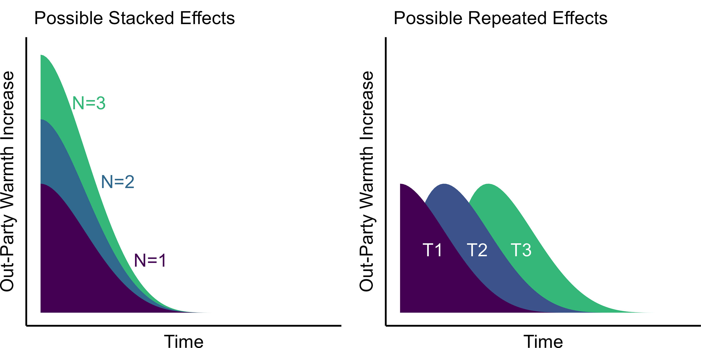
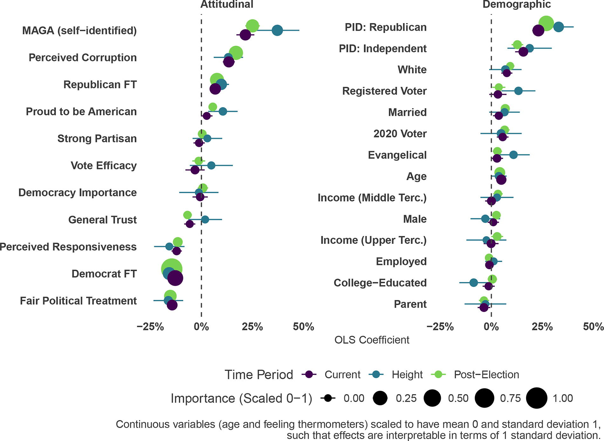
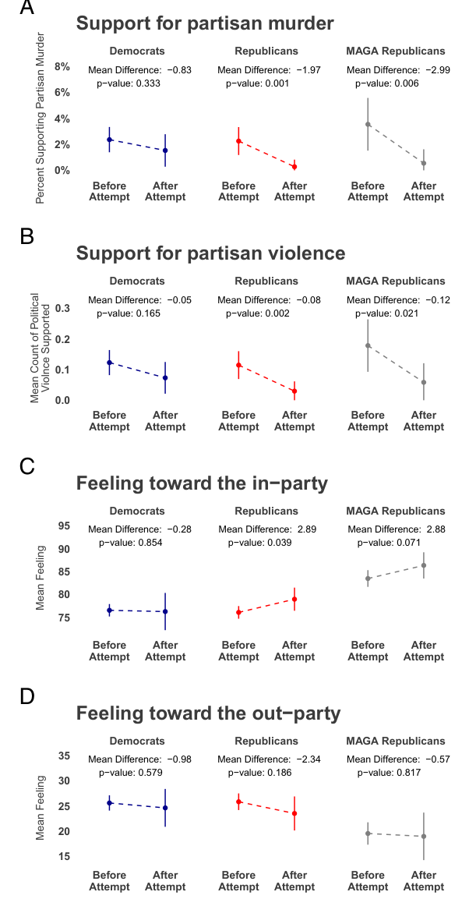
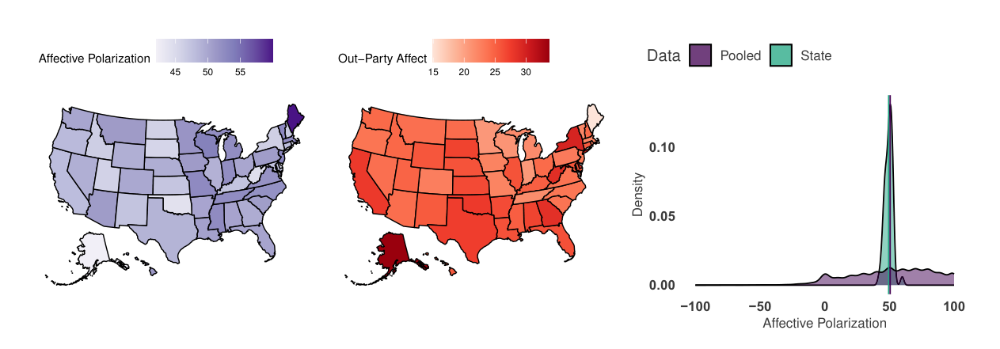
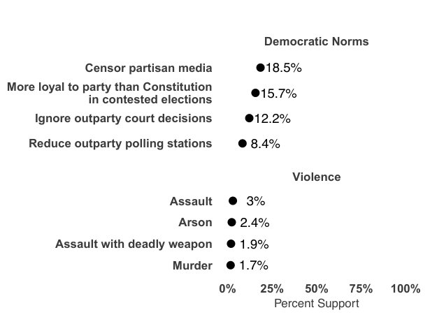
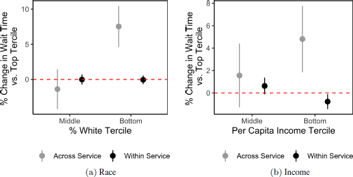
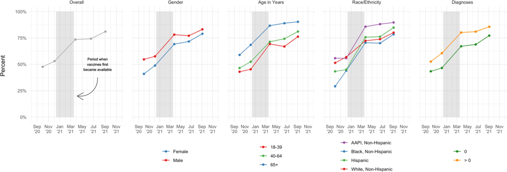

## Publications

11.
Ploger, Gavin, <strong>Derek Holliday</strong>, Yphtach Lelkes, and Sean J. Westwood. Conditionally Accepted. "Skepticism and Common Ground in Political Reform: Navigating Public, Elite, and Partisan Divides." <em>Nature Communications</em>.

Abstract
Voters, politicians, activists, and scholars have proposed a range of reforms intended to stabilize democracy and reduce polarization in the United States. For any of these changes to succeed, they must have the support of both the mass public and the policymakers who would implement them. We surveyed 1,000 citizens and 1,300 politicians in the United States to assess whether each group views ten potential democratic reforms as implementable and effective. Neither group—especially elites—is optimistic about the likelihood that these reforms will be implemented, but both are moderately optimistic about their effectiveness if implemented. We find little evidence that either group cherry-picks among reforms; instead, the public and politicians take a consistently lukewarm view of reforms overall. These attitudes are similar across party lines, suggesting opportunities for coalition-building around potential reforms. Ultimately, our data suggest that although reformers face significant barriers to implementation, there is more agreement than disagreement about the effectiveness of these reforms, making efforts to pursue structural change worth the investment.

<figure class="pub-figure"><figcaption>Fig. 1: public and policymaker ratings of ten reforms’ effectiveness and likelihood.</figcaption></figure>

10.
<strong>Holliday, Derek</strong> and Aaron Rudkin. Forthcoming. <a href="https://doi.org/10.1086/741831" target="_blank" rel="noopener">"DC On My Mind: Voter Evaluations of Nationalized Policy Positions in State and Local Elections."</a> <em>Journal of Politics</em>. <ul style="margin-top: 4px; margin-bottom: 0; font-size: 0.95em;"> <li>APSA State Politics and Policy Section Best Paper Award (2022).</li> </ul>

Abstract
Recent research demonstrates that national, state, and local election outcomes are becoming closely correlated, raising concerns that political accountability may be undermined by voters making electoral decisions using information irrelevant to subnational governance. The observational and aggregate data used to make these conclusions, however, are consistent with an alternative: the dimensions of national and subnational politics are correlated, and voters make informed decisions with imperfect but useful information. We distinguish between these possibilities using conjoint experiments varying the contested office level and candidate policy positions across national, state, and local politics. We find national issues more strongly affect candidate selection, but do not eliminate the effects of state and local issues. Additionally, national, state, and local issues affect candidate selection for all levels of office. Our results suggest U.S. politics is nationalized, but not fundamentally broken, with meaningful opportunities for the enforcement of political accountability in low-information settings.

<figure class="pub-figure"><figcaption>Fig. 4: issue effects (AMCE) rise with partisan signal intensity at every level of office.</figcaption></figure>

9.
Tausanovitch, Chris and <strong>Derek Holliday</strong>. 2026 <a href="https://doi.org/10.1017/psrm.2024.71" target="_blank" rel="noopener"> "Income, Education, and Policy Priorities." </a> <em>Political Science Research and Methods</em> 14 (1): 177-189.

Abstract
Are people&#x27;s priorities associated with their income and education levels? There is a long history in political science of claims that priorities are driven by economic interests, but also that low-income and low-education people fail to prioritize their economic interests. In this paper we use measures of revealed importance from Sides et al. (2023) to evaluate the priorities of high- and low-income/education voters with respect to 44 different policies. It is well known that there are substantial differences in the preferences of people with lower incomes or education levels and people with higher incomes or education levels, but conditional on preferences we find very small differences among education and income groups in terms of priorities . Like high-income and high-education voters, lower-income and education voters care most about the major issues of the day. They do not care systematically more or less than other voters about policies that expand social welfare, redistribution, or labor rights.

<figure class="pub-figure"><figcaption>Fig. 5: high- and low-income respondents weight policies nearly identically.</figcaption></figure>

8.
<strong>Holliday, Derek</strong>, Yphtach Lelkes, and Sean J. Westwood. 2025. <a href="https://www.pnas.org/doi/10.1073/pnas.2508827122" target="_blank" rel="noopener"> "Why Depolarization is Hard: Evaluating Attempts to Decrease Partisan Animosity in America." </a> <em>Proceedings of the National Academy of Sciences</em> 122 (39).

Abstract
Affective polarization is a corrosive force in American politics. While numerous studies have developed interventions to reduce it, their capacity for creating lasting, large-scale change is unclear. This study comprehensively evaluates existing interventions through a meta-analysis of 77 treatments from 25 published studies and two large-scale experiments. Our meta-analysis reveals that the average effect of treatments on animosity is modest (a 5.4-point shift on a 101-point scale), and decays within two weeks. We experimentally test whether stacking multiple treatments in one sitting or repeating them over time as &quot;booster shots&quot; enhances their impact. We find no evidence that multiple or repeated exposures produce substantially larger or more durable reductions in partisan animosity. This reveals the uneven utility of these interventions. They serve as valuable tools for testing the psychological mechanisms of polarization, but our findings indicate they are not, on their own, a scalable solution for reducing societal-level conflict. We conclude that achieving lasting depolarization will likely require a shift in focus, moving beyond individual-level treatments to address the elite behaviors and structural incentives that fuel partisan conflict.

<figure class="pub-figure"><figcaption>Fig. 1: hypothesized stacked vs. repeated treatment effects.</figcaption></figure>

7.
<strong>Holliday, Derek</strong>, Justin Grimmer, Yphtach Lelkes, and Sean J. Westwood. 2025. <a href="https://www.liebertpub.com/doi/abs/10.1089/elj.2024.0010" target="_blank" rel="noopener"> "Who are the Election Skeptics? Evidence from the 2022 Midterm Elections." </a> <em>Election Law Journal</em> 24 (1): 1-17.

Abstract
Faith in American elections is eroding, with politicians frequently questioning the legitimacy of election results and spreading misinformation about voter fraud. Substantial work has been done to refute misinformation and increase confidence in elections, but often without a clear picture of who skeptics are and why they are skeptical. Using a nationally representative survey from around the 2022 midterm election ( N = 5,244) and beyond ( N = 77,325), we provide a comprehensive profile of election skeptics: their prevalence, views, and justifications. Our use of quantitative and qualitative data reveals a more milquetoast portrait of skeptics. Skeptics are demographically closer to the broader electorate than not, and the self-reported underpinnings of skepticism are more mundane than conspiratorial. Over half of skeptics claim they are skeptical because of how elections are run and nearly one-in-five skeptics claim they are skeptical because of the other party’s performance in recent elections, which we corroborate through an event study of the 2022 election.

<figure class="pub-figure"><figcaption>Fig. 4: attitudinal and demographic predictors of election skepticism over time.</figcaption></figure>

6.
<strong>Holliday, Derek</strong>, Yphtach Lelkes, and Sean J. Westwood. 2024. <a href="https://www.pnas.org/doi/10.1073/pnas.2414689121" target="_blank" rel="noopener"> "The July 2024 Trump Assassination Attempt was Followed by Lower In-Group Support for Partisan Violence and Increased Group Unity." </a> <em>Proceedings of the National Academy of Sciences</em> 121 (49).

Abstract
The attempted assassination of Donald Trump led to widespread concern that the event would escalate political violence between U.S. partisans. While some politicians pleaded for Americans to unite against political violence and &quot;turn down the temperature&quot; on partisan hostility, others continued to engage in inflammatory rhetoric and blame. Using a national survey in the field at the time of the assassination attempt, we take the temperature of America&#x27;s partisans before and after the event. We exploit the natural variation induced by the assassination attempt and large daily survey coverage (preattempt: 3,572; postattempt: 703; and 690 in a panel) in the days before and after the attempt to estimate the causal effects of extreme partisan violence on measures of partisan animosity and identity. Using panel and cross-sectional interrupted time series analysis, we find no evidence that the event increased tensions or support for retaliatory violence in the immediate aftermath. On the contrary, Republicans, including MAGA Republicans, became significantly less supportive of partisan violence against Democrats. Republicans also did not become more hostile toward Democrats; instead, their attachment to their own party significantly increased. Democrats experienced no change in attitudes. While nearly a third of Americans have no positive feelings toward the other party, and a supermajority have negative feelings, this animosity was not exacerbated by an extreme but salient instance of partisan violence. Despite the ills of modern political conflict, extreme partisan violence did not cause an immediate upsurge in support for violence.

<figure class="pub-figure"><figcaption>Fig. 1: support for violence and party feelings, before vs. after.</figcaption></figure>

5.
<strong>Holliday, Derek</strong>, Yphtach Lelkes, and Sean J. Westwood. 2024. <a href="https://doi.org/10.1093/pnasnexus/pgae310" target="_blank" rel="noopener"> "Affective Polarization is Uniformly Distributed Across American States." </a> <em>PNAS Nexus</em> 3 (10).

Abstract
US partisans view each other with increasing negativity. While many attribute the growth of such affective polarization to nationally cross-cutting forces, such as ideological partisan sorting or access to partisan media, others emphasize the effects of contextual and institutional forces. For the first time, we introduce and explore data sufficiently granular to fully map the extent of partisan animosity across the US states. With a massive, nationally representative survey we find that, counter to expectations, variation in affective polarization across states is relatively small, and is instead largely a function of individual-level attitudinal (but not demographic) characteristics. While elections pit regions of the country against others, our results suggest affective polarization is a national, not regional, problem, requiring national interventions.

<figure class="pub-figure"><figcaption>Fig. 1: affective polarization and out-party affect by state.</figcaption></figure>

4.
<strong>Holliday, Derek</strong>, Shanto Iyengar, Yphtach Lelkes, and Sean J. Westwood. 2024. <a href="https://www.pnas.org/doi/10.1073/pnas.2313013121" target="_blank" rel="noopener"> "Uncommon and nonpartisan: Antidemocratic attitudes in the American public." </a> <em>Proceedings of the National Academy of Sciences</em> 121 (13).

Abstract
Democratic regimes flourish only when there is broad acceptance of an extensive set of norms and values. In the United States, fundamental democratic norms have recently come under threat from prominent Republican officials. We investigate whether this antidemocratic posture has spread from the elite level to rank-and-file partisans. Exploiting data from a massive repeated cross-sectional and panel survey ([Formula: see text] = 45,095 and 5,231 respectively), we find that overwhelming majorities of the public oppose violations of democratic norms, and virtually nobody supports partisan violence. This bipartisan consensus remains unchanged over time despite high levels of affective polarization and exposure to divisive elite rhetoric during the 2022 political campaign. Additionally, we find no evidence that elected officials&#x27; practice of election denialism encourages their constituents to express antidemocratic attitudes. Overall, these results suggest that the clear and present threat to American democracy comes from unilateral actions by political elites that stand in contrast to the views of their constituents. In closing, we consider the implications of the stark disconnect between the behavior of Republican elites and the attitudes of Republican voters.

<figure class="pub-figure"><figcaption>Fig. 1: support for norm violations and political violence.</figcaption></figure>

3.
Hamel, Brian and <strong>Derek Holliday</strong>. 2024 <a href="http://dx.doi.org/10.1561/100.00022089" target="_blank" rel="noopener"> "Unequal Responsiveness in City Service Delivery: Evidence from 42 Million 311 Calls." </a> <em>Quarterly Journal of Political Science</em> 19 (3): 243-274. <ul style="margin-top: 4px; margin-bottom: 0; font-size: 0.95em;"> <li>Not Another Politics Podcast (UChicago Harris School of Public Policy): <a href="https://podcasts.apple.com/us/podcast/do-city-services-move-faster-for-affluent-and-white/id1496412542?i=1000661775943" target="_blank" rel="noopener">"Do City Services Move Faster for Affluent and White Neighborhoods?"</a></li> </ul>

Abstract
We assess unequal responsiveness to citizen demands for municipal goods and services using a dataset of about 42 million 311 requests from 13 large cities between 2011 and 2019. We report three findings. First, we find no evidence that cities respond to requests from whiter and more affluent neighborhoods faster than they do the same type of request from less white and affluent neighborhoods, even after accounting for proxies of neighborhood need. On average, however, white, rich neighborhoods receive faster responses to their calls than non-white, poor neighborhoods. Additional analyses suggest that these disparities may not reflect deliberate bias on the part of cities in favor of the needs of whites and the rich, but rather that non-white and poor neighborhoods tend to ask for services that require more time and resources for the city to respond to. Our paper provides the most comprehensive and contemporary analysis to date of inequalities in U.S. city service delivery.

<figure class="pub-figure"><figcaption>Wait-time gaps by neighborhood race and income, across vs. within services.</figcaption></figure>

2.
Guerin, Rebecca J., Arash Naeim, Ryan Baxter-King, Andrea H. Okun, <strong>Derek Holliday</strong>, and Lynn Vavreck. 2022. <a href="https://doi.org/10.1016/j.vaccine.2022.11.001" target="_blank" rel="noopener"> "Parental intentions to vaccinate children against COVID-19: Findings from a U.S. National Survey." </a> <em>Vaccine</em> 41 (1): 101-108.

Abstract
We examined parents&#x27; COVID-19 vaccination intentions for their children, reasons for not vaccinating, and the potential impact of a school/daycare vaccination requirement or pediatrician’s recommendation on vaccination intentions. Two online surveys were conducted in June–July and September–October 2021, before pediatric COVID-19 vaccines were authorized for emergency use in children age &lt; 12 years, with an internet-based, non-probability sample of U.S. adults. Respondents with children (age &lt; 18 years) in the household were asked about their intention (likelihood) of vaccinating these children against COVID-19. Weighted Chi-square tests using a Rao-Scott correction were performed. Vaccinated (45.7 %) versus unvaccinated (6.9 %) parents were almost seven times more likely to have vaccinated their 12–17-year-old children against COVID-19. Approximately 58.4 % of respondents with unvaccinated children ages 2–11 years and 42.4 % of those with children &lt; 2 years said they are “very” or “extremely likely” to vaccinate these children against COVID-19. Female parents were significantly more likely (p &lt; .01 to p &lt; .001) to express lower levels of COVID-19 vaccine intentions. Across all age groups of children unvaccinated against COVID-19, parental vaccine intentions increased with increased household income and education levels. COVID-19 vaccine side effects and safety concerns were primary reasons for not vaccinating children. Strategies including school vaccination requirements and recommendations from pediatricians were shown to increase parental COVID-19 vaccination intentions for some. More research is needed on factors that increase/hinder COVID-19 pediatric vaccine uptake.

1.
Naeim, Arash, Rebecca Guerin, Ryan Baxter-King, Andrea Okun, Neil Wenger, Karen Sepucha, Annette Stanton, Aaron Rudkin, <strong>Derek Holliday</strong>, Alexander Rossell Hayes, and Lynn Vavreck. 2022. <a href="https://doi.org/10.1016/j.vaccine.2022.09.024" target="_blank" rel="noopener"> "Strategies to increase the intention to get vaccinated against COVID-19: Findings from a nationally representative survey of US adults, October 2020 to October 2021." </a> <em>Vaccine</em> 40 (52): 7571-7578.

Abstract
Objectives We examined COVID-19 vaccination status, intention, and hesitancy and the effects of five strategies to increase the willingness of unvaccinated adults (≥18 years) to get a COVID vaccine. Methods Online surveys were conducted between October 1–17, 2020 (N = 14,946), December 4–16, 2020 (N = 15,229), April 8–22, 2021 (N = 14,557), June 17-July 6, 2021 (N = 30,857), and September 3-October 4, 2021 (N = 33,088) with an internet-based, non-probability opt-in sample of U.S. adults matching demographic quotas. Respondents were asked about current COVID-19 vaccination status, intention and hesitancy to get vaccinated, and reasons for vaccine hesitancy. Unvaccinated respondents were assigned to treatment groups to test the effect of five strategies (endorsements, changing social restrictions, financial incentives, vaccine requirements for certain activities, and vaccine requirements for work). Chi-square tests of independence were performed to detect differences in the response distributions. Results Willingness to be vaccinated (defined as being vaccinated or planning to be) increased over time from 47.6 % in October 2020 to 81.1 % in October 2021. By October 2021, across most demographic groups, over 75 % of survey respondents had been or planned to be vaccinated. In terms of strategies: (1) endorsements had no positive effect, (2) relaxing the need for masks and social distancing increased Intention to Get Vaccinated (IGV) by 6.4 % (p &lt; 0.01), (3) offering financial incentives increased the IGV between 12.3 and 18.9 % (p &lt;.001), (4) vaccine requirements for attending sporting events or traveling increased IGV by 7.8 % and 9.1 %, respectively (p = 0.02), and vaccine requirement for work increased IGV by 35.4 %. The leading causes (not mutually exclusive) for hesitancy were concerns regarding vaccine safety (52.5 %) or side effects (51.6 %), trust in the government’s motives (41.0 %), and concerns about vaccine effectiveness (37.6 %). Conclusions These findings suggest that multiple strategies may be effective and needed to increase COVID-19 vaccination among hesitant adults during the pandemic.

<figure class="pub-figure"><figcaption>Vaccination intention over time by gender, age, race/ethnicity, and diagnoses.</figcaption></figure>

## Under Review

1. <a href="https://osf.io/preprints/osf/qacmr" target="_blank" rel="noopener">Anti-Democratic Condemnation has Limited and Inconsistent Effects on Vote Choice and Democratic Attitudes</a> (Revise and Resubmit at *British Journal of Political Science* with Erin Walk, Yphtach Lelkes, and Sean J. Westwood)

2. America's Political Pulse, a database of democratic attitudes across all levels of U.S. government (Revise and Resubmit at *Scientific Data*, with Yphtach Lelkes, Ellie M. Mitchell, and Sean J. Westwood)

3. A Republic, If You Like It: Policy Preferences Condition Perceptions of Democracy (with Sean J. Westwood)

4. Shared Standards, Divided Verdicts: How Party Identity Shapes Perceptions of Domestic Terrorism (with Sean J. Westwood)

## Projects in Progress

1. <a href="https://osf.io/preprints/socarxiv/rvtsf_v1" target="_blank" rel="noopener">Changing Partisanship Contributes Significantly to Rising Affective Polarization: Evidence from a Decomposition of Panel Data</a>

2. <a href="pdfs/Holliday_JMP_v09012023.pdf" target="_blank" rel="noopener">Is All Politics Presidential? Decomposing partisan patterns in U.S. election outcomes across offices, 1972-2020</a>

3. <a href="pdfs/Holliday_JMP_v09102024.pdf" target="_blank" rel="noopener">Amateurs: A (Mostly) Stable, Undesired, but Benign Presence in American Politics</a>

4. <a href="pdfs/holliday_nationalizedrhetoric_09112022.pdf" target="_blank" rel="noopener">Nationalized Elections, Localized Campaigns? A Supervised Machine Learning Approach to Measuring Nationalized Political Rhetoric</a>

5. Endorsement Effects for COVID-19 Policy Support (with Ryan Baxter-King)

## Other Writing

1. **Holliday, Derek**, Tyler Reny, Alex Rossell Hayes, Aaron Rudkin, Chris Tausanovitch, and Lynn Vavreck. 2021. <a href="https://www.voterstudygroup.org/uploads/reports/Data/Nationscape-Methodology-Representative-Assessment-2021Dec.pdf" target="_blank" rel="noopener">"Democracy Fund + UCLA Nationscape Methodology and Representativeness Assessment."</a>

